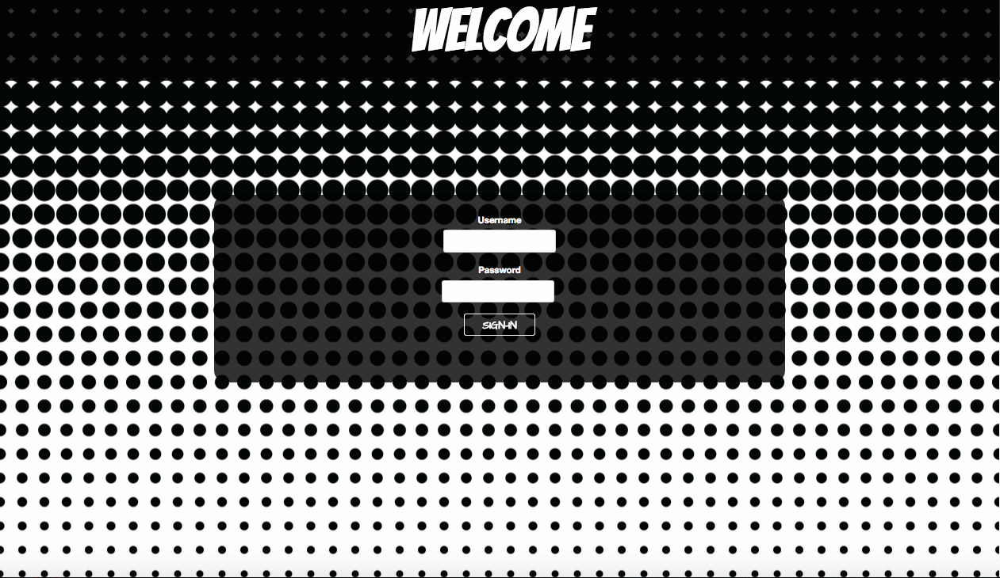

#Welcome to the Marvel Universe!

Marvel TapIt is an interactive two player melee where each player presses a key to attack
their opponent to elimination.  

This application was developed using Ruby on Rails and Javascript to create the animated environment.  The development team implemented this application to consume images and data from the Marvel API via AJAX calls to render character information.

The development team came across challenges in regards to starting points for use of technologies..but ultimately....

calling functions?

determining what technologies to use

